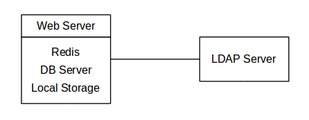

# Desarrollo del escenario 1

Para esta primera parte de la práctica se propone la construcción del sistema planteado en el siguiente esquema a partir del uso de la tecnología `docker-compose`

<p align='center'>

</p>

Dentro de dicho fichero de orquestación procedemos a definir los siguientes microservicios

## Owncloud
Este sistema 

```
  owncloud1:
    image: owncloud/server:10.12.0
    container_name: owncloud1
    restart: always
    ports:
      - "8080:8080"
    environment:
      OWNCLOUD_DOMAIN: localhost 
      OWNCLOUD_DB_TYPE: mysql
      OWNCLOUD_DB_NAME: owncloud
      OWNCLOUD_DB_USERNAME: owncloud
      OWNCLOUD_DB_PASSWORD: owncloud
      OWNCLOUD_DB_HOST: mysql
      OWNCLOUD_ADMIN_USERNAME: user     
      OWNCLOUD_ADMIN_PASSWORD: pass  
      OWNCLOUD_MYSQL_UTF8MB4: true
      OWNCLOUD_REDIS_ENABLED: true
      OWNCLOUD_REDIS_HOST: redis
    depends_on:
      - redis
      - openldap
      - mysql
    volumes:
      - files_owncloud:/mnt/data
    networks:
      - net
```

## MariaDB

```
  mysql:
    image: mariadb:10.7
    container_name: mysql
    restart: always
    environment:
      MYSQL_ROOT_PASSWORD: 111
      MYSQL_PORT: 3306
      MYSQL_USER: owncloud
      MYSQL_PASSWORD: owncloud
      MYSQL_DATABASE: owncloud
      MYSQL_LOWER_CASE_TABLE_NAMES: 0
    volumes:
      - data_mysql_master:/var/lib/mysql
    networks:
      - net
```

## Redis

```

```

## OpenLDAP
