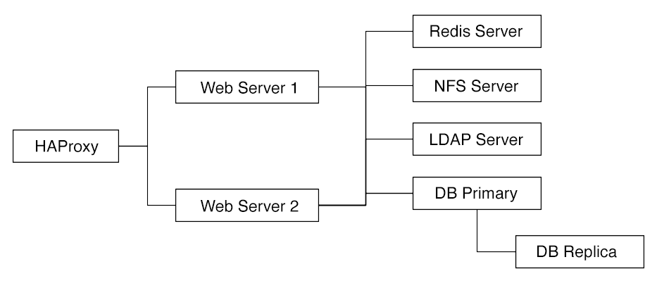
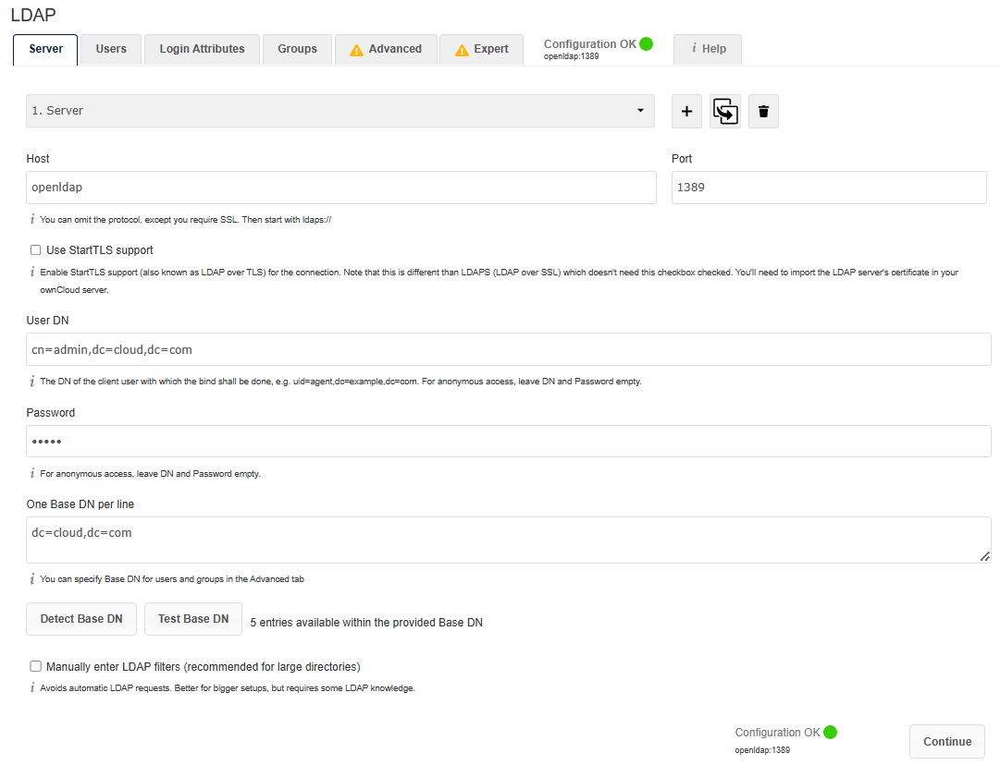
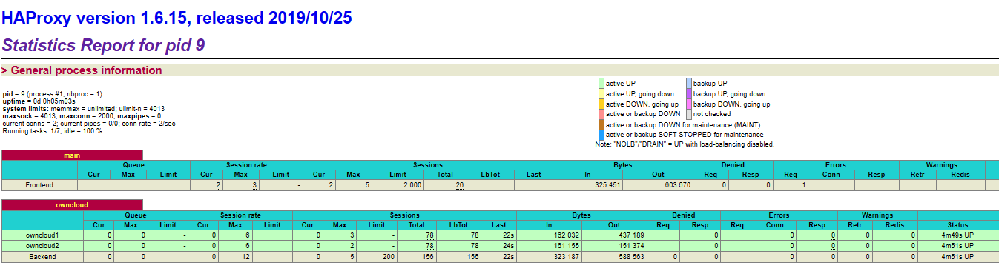
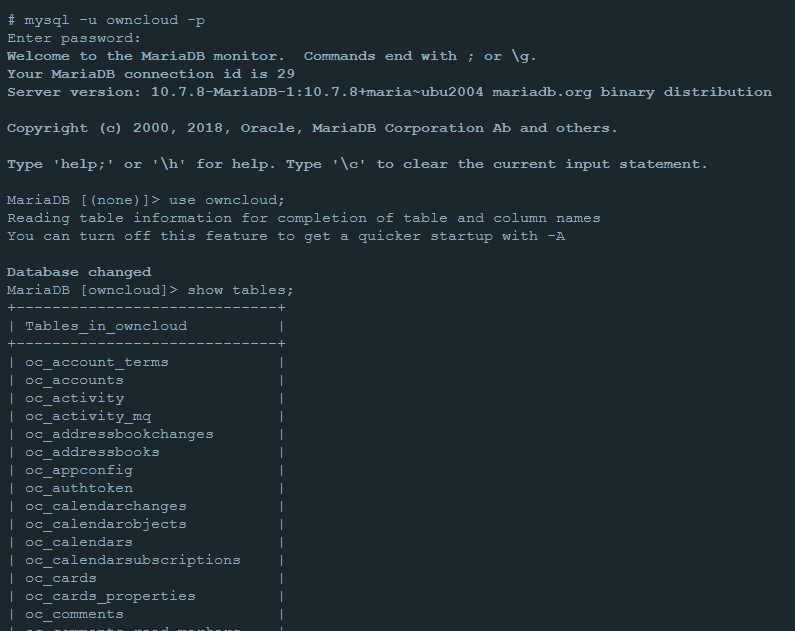

# Práctica 1: Elaboración de escenario 2

**Nombre del estudiante**: *Roberto Castro Izurieta*

En esta sección se plasman las configuraciones y ficheros utilizador para la elaboración del escenario 2 utilizando la teccnología de `docker-compose`.

## Arquitectura implementada

<p align='center'>

</p>

Esta arquitectura se perfila como una versión más robusta de la presentada en el primer escenario, añadiendo ahora un sistema de balanceo de carga con HAProxy, junto con la replicación de uno de los microservicios ofrecidos. Para este trabajo se decidió replicar el microservicio de `Owncloud`, generándose ahora dos servidores que serán afectados directamente por nuestro sistema de balanceo de carga. El fichero docker-compose se puede consultar directamente [aquí](https://github.com/Roark98/CCPractica1/blob/main/Escenario%202/docker-compose.yml).

A continuación se especifican las configuraciones, scripts y ficheros que se han requerido para la elaboración de este sistema.

## Owncloud

Para este servicio de almacenamiento en la nube se decidió optar por utilizar la imágen oficial [owncloud/server](https://hub.docker.com/r/owncloud/server) en su versión 10.12.0. 

```
  owncloud1:
    image: owncloud/server:10.12.0
    container_name: owncloud1
    restart: always
    expose:
      - 8080
    environment:
      OWNCLOUD_DOMAIN: localhost 
      OWNCLOUD_DB_TYPE: mysql
      OWNCLOUD_DB_NAME: owncloud
      OWNCLOUD_DB_USERNAME: owncloud
      OWNCLOUD_DB_PASSWORD: owncloud
      OWNCLOUD_DB_HOST: mysql
      OWNCLOUD_ADMIN_USERNAME: user     
      OWNCLOUD_ADMIN_PASSWORD: pass  
      OWNCLOUD_MYSQL_UTF8MB4: true
      OWNCLOUD_REDIS_ENABLED: true
      OWNCLOUD_REDIS_HOST: redis
    depends_on:
      - redis
      - openldap
      - mysql
    volumes:
      - files_owncloud:/mnt/data
    networks:
      - net
```

Para la construcción y orquestación de este microservicio, se le asignó el nombre de contenedor 'owncloud1' con el fin de poder usar dicho nombre como abreviación de su IP en futuros pasos. Se decide exponer el puerto por defecto de Owncloud (8080) para que éste pueda luego ser accesible por nuestro servidor HAProxy, pero no desde fueras del sistema. 
Dado que utilizaremos una base de datos `MariaDB`, procedemos a definir las variables de entorno que permitan acceder a la base de datos deseada, al igual que activar la funcionalidad de `Redis`. Adicionalmente, definimos la dependencia que tiene este contenedor de los microservicios de `Redis`, `Openldap` y `MariaDB`.
Con el fin de conseguir persistencia de datos, establecemos el volumen `file_owncloud` en nuestra máquina host que mapeará al directorio `/mnt/data` del entorno virtual.
Finalmente, con el fin de procurar conectividad entre contenedores, asignamos a nuestro servidor Owncloud a la red `net`.

Dentro del mismo fichero `docker-compose` se crea una copia de este mismo contenedor renombrado ahora como `owncloud2`, cumpliendo así con el requerimiento propuesto por esta actividad.

## HAProxy

Para nuestro contendor de HAProxy, utilizamos su imágen oficial en su versión 1.6, estableciendo el nombre de `haproxy` al contenedor para fines de identificación.

```
  haproxy:
    image: haproxy:1.6
    container_name: haproxy
    restart: always
    depends_on:
      - owncloud1
      - owncloud2
    ports:
      - '80:80'
    volumes:
      - haproxy_conf:/usr/local/etc/haproxy
      - ./haproxy/haproxy.cfg:/usr/local/etc/haproxy/haproxy.cfg:ro
    networks:
      - net
```

Este microservicio tambiénn se incluye dentro de nuestra red `net`, además de definirse una dependencia de los contenedores `owncloud1` y `owncloud2`. A diferencia de los contenedores de la sección anterior, aquí se utiliza el parámetro `ports` para hacer un mapeo del puerto hacia el exterior, ya que este servicio será el que reciba las peticiones entrantes al sistema para luego distribuirlas según el algoritmo de balanceo elegido.
Entre los volúmenes de persistencia definidos destaca el que hace referencia al fichero `haproxy.cfg`.
```
global
  debug
  maxconn 2000

defaults
  mode http
  timeout client 10s
  timeout connect 5s
  timeout server 10s
  timeout http-request 10s
  log global

frontend main
  bind *:80
  stats enable
  stats uri /stats
  default_backend owncloud

backend owncloud
    stats enable
    stats uri /stats
    balance roundrobin
    option httpchk
    option forwardfor
    option http-server-close
    server owncloud1 owncloud1:8080 check
    server owncloud2 owncloud2:8080 check
```
Dentro de este fichero de configuración inherente de HAProxy, establecemos nuestro frontend que recibirá peticiones en el puerto 80, con el cuál si consultamos la ruta `/stats` podremos visualizar la actividad de los servidores a los que se está redirigiendo el tráfico.
Dentro del backend, establecemos que se utilizará un algoritmo de balanceo de `roundrobin`, el cual dirigirá las peticiones recibidas a los servidores `owncloud1` y `owncloud2` definidos en nuestro fichero `docker-compose`, escuchando en el puerto `8080` cada uno.


## MariaDB

Para el servicio de MariaDB se utilizó su imagen oficial en su versión 10.7, y otorgándole el nombre `mysql` al contenedor.

```
  mysql:
    image: mariadb:10.7
    container_name: mysql
    restart: always
    environment:
      MYSQL_ROOT_PASSWORD: 111
      MYSQL_PORT: 3306
      MYSQL_USER: owncloud
      MYSQL_PASSWORD: owncloud
      MYSQL_DATABASE: owncloud
      MYSQL_LOWER_CASE_TABLE_NAMES: 0
    volumes:
      - data_mariadb:/var/lib/mysql
    networks:
      - net
```

Las variables de entorno utilizadas para este contenedor respetan a aquellas definidas en los servicios Owncloud, de esta forma podemos asegurarnos de que se pueda llevar a cabo una conectividad exitosa entre ambos servicios. Adicionalmente, en continuidad de lo antes mencionado, este contenedor también es colocado dentro de la red `net`.

## Redis

El contenedor nombredo como `redis` es el que menos configuración requirió. Éste se instancia a partir de la imagen oficial de `redis` en su versión 7.

```
 redis:
    image: redis:7
    container_name: redis
    restart: always
    environment:
      REDIS_DATABASES: 1
    volumes:
      - redis_cache:/data
    networks:
      - net
```

Dentro del fichero de orquestación únicamente se define un volumen para la persistencia de los datos, la red a la que pertenece, y la cantidad de bases de datos a utilizarse.

## OpenLDAP

Ciertamente este microservicio resulta en el más complejo junto con Owncloud, pero afortunadamente la imagen que ofrece `bitnami` ofrece algunas facilidades en comparación a la alternativa más popular.

```
 openldap:
    image: bitnami/openldap:2.5
    container_name: openldap
    restart: always
    ports:
      - "389:1389"
    environment:
      LDAP_ORGANISATION: Cloud Computing
      LDAP_DOMAIN: cloud.com
      LDAP_ROOT: dc=cloud,dc=com
      LDAP_ADMIN_PASSWORD: admin
    volumes:
      - openldap_data:/bitnami/openldap
    networks:
      - net
```

Se destaca que, a diferencia de la versión original, esta versión de OpenLDAP use el puerto `1389` por defecto, por lo que para apegarnos un poco a lo "típico", se lleva a cabo un mapeo de puertos, pudiendo acceder a este servicio por el puerto `389` desde el exterior. Aquí se utiliza el atributo `ports` principalmente para que se pueda modificar y añadir usuarios cómodamente desde la máquina host.

En las variables de entorno podemos ver cómo se define el dominio `cloud.com` para nuestro servidor, el cual aprovechará de su correspondiente volumen para persistencia.

Considerando que como requerimiento de la práctica se debía contar con al menos un grupo de usuarios, la imágen utilizada nos ofrece justamente dicho aspecto por defecto. Si recurrimos a la [documentación](https://hub.docker.com/r/bitnami/openldap/) de dicha imágen, podemos observar que de manera predeterminada se incorporan los usuarios `user01` y `user02` con sus respectivas contraseñas `bitnami1` y `bitnami2`. Dichos usuarios pertenecen a un grupo por defecto `readers` que a su vez se encuentran bajo la unidad organizativa `users`.

## Pruebas de funcionamiento

Habiendo ingresado como administrador al servicio Owncloud y luego de haber instalado la extensión de integración LDAP, se realizó la respectiva configuración proporcionando los datos referentes al servidor OpenLDAP ya creado. Se puede observar el estado `OK` del servidor, al proporcionar el host `openldap` (nombre de nuestro contenedor), el puerto interno del mismo, y las credenciales de administrador.

<p align='center'>

</p>

Teniendo ya la posibilidad de que nuestros usuarios accedan al servicio de almacenamiento cloud, podemos revisar las mediciones realizadas por el servicio `HAProxy` dentro de la dirección `localhost:80/stats`. Se puede ver al algoritmo `roundrobin` en acción, repartiendo satisfactoriamente la carga entre ambos servidores owncloud.

<p align='center'>

</p>

Adicionalmente, podemos ingresar en nuestro contenedor `MariaDB`, 

<p align='center'>

</p>

## Referencias
- https://hub.docker.com/r/owncloud/server
- https://hub.docker.com/r/bitnami/openldap/
- https://doc.owncloud.com/server/next/admin_manual/installation/docker/
- https://www.haproxy.com/blog/how-to-run-haproxy-with-docker
- https://doc.owncloud.com/server/next/admin_manual/configuration/user/user_auth_ldap.html


